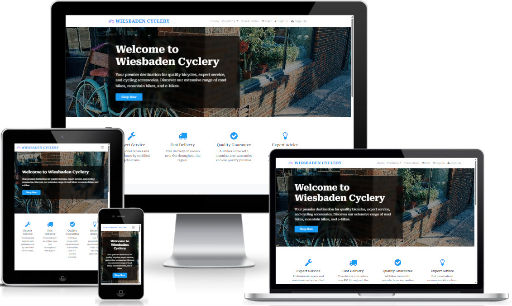
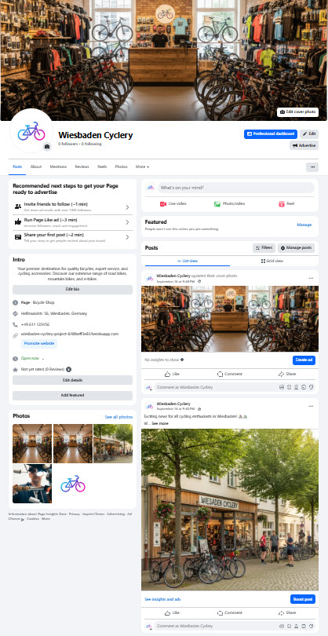

# Wiesbaden Cyclery - Professional E-commerce Platform

[](https://www.djangoproject.com/)
[](https://www.python.org/)
[](https://getbootstrap.com/)
[](https://stripe.com/)
[](https://aws.amazon.com/s3/)
[](#testing)

A production-ready Django e-commerce platform for bicycle retail with secure payments, user management, and professional deployment architecture.

## Project Overview

Wiesbaden Cyclery is a full-featured e-commerce platform built with Django 3.2.25 for bicycle shops, providing complete online shopping with secure checkout, user accounts, and administrative tools.

### Responsive Design

Fully responsive across all devices using Bootstrap 4 mobile-first approach:



### Design Planning

Comprehensive wireframes covering all pages and user flows: [docs/project_wireframes.pdf](docs/project_wireframes.pdf)

### Social Media Presence

**Facebook Business Page**: [Wiesbaden Cyclery](https://www.facebook.com/people/Wiesbaden-Cyclery/61580595100397/)



### Key Features

- **E-commerce**: Product catalog, shopping cart, secure checkout, stock tracking
- **User Management**: Registration, authentication, profiles, staff permissions
- **Product Management**: Dual interface (staff portal + Django admin)
- **Payments**: Stripe integration (EUR currency)
- **Email**: Order confirmations via Gmail SMTP
- **Newsletter**: Mailchimp with GDPR compliance
- **Order Tracking**: Self-service status tracking
- **Legal Compliance**: Privacy Policy, Terms of Service, GDPR cookie consent
- **Reviews**: Customer ratings and reviews
- **SEO**: Meta tags, sitemaps, structured data
- **Responsive**: Bootstrap 4 mobile-first
- **Error Pages**: Custom 404 and 500 pages matching project design
- **Social**: Facebook Business page
- **Analytics**: Facebook Pixel & Google Analytics 4

## Technology Stack

### Backend
- **Django 3.2.25** (LTS) - Web framework
- **Python 3.11** - Programming language
- **SQLite** - Development database
- **PostgreSQL** - Production database (Code Institute)

### Frontend
- **Bootstrap 4.6.2** - CSS framework
- **Font Awesome 4.7.0** - Icons
- **jQuery 3.5.1** - JavaScript library
- **Google Fonts (Roboto Serif)** - Typography

## Installation & Setup

### Prerequisites
- Python 3.11 or higher
- Git

### Local Development Setup

1. **Clone the repository**
```bash
git clone <repository-url>
cd wiesbaden_cyclery_project
```

2. **Install dependencies**
```bash
pip install -r requirements.txt
```

3. **Environment configuration**
Copy `.env.example` to `.env` and configure your settings:
```env
DEBUG=True
SECRET_KEY=your-secret-key-here

# Email settings (Gmail SMTP)
EMAIL_HOST_USER=your-email@gmail.com
EMAIL_HOST_PASSWORD=your-app-password

# Analytics (optional)
FB_PIXEL_ID=123456789012345
GA_MEASUREMENT_ID=G-XXXXXXXXXX

# For production with Code Institute PostgreSQL:
# CI_DATABASE_URL=your_code_institute_database_url_here
```

4. **Database setup**
```bash
python manage.py migrate
python manage.py createsuperuser
```

5. **Run development server**
```bash
python manage.py runserver
```

Visit `http://127.0.0.1:8000` to access the application.

## Product Catalog

56 products across 6 categories: Road Bikes, Mountain Bikes, Electric Bikes, Accessories, Components, Sale Items. Professional Unsplash photography for all products.

### Product Management

Products can be managed through two interfaces:

1. **Staff Product Management** (`/products/management/`)
   - User-friendly interface for staff users
   - Add, edit, and delete products
   - Upload product images
   - Manage sizes and stock levels
   - Accessible to users with staff permissions

2. **Django Admin Interface** (`/admin/products/product/`)
   - Full administrative control
   - Bulk operations and advanced filtering
   - Direct database access
   - Complete product and category management
   - Accessible to superuser accounts

## Development Methodology

### Agile Development Process

This project was developed using **Agile practices** with iterative development across 12 stages:

**Foundation → Authentication → Catalog → Cart → Orders → Payments → Email → Legal → Reviews → Testing → SEO → Stock Tracking**

### Project Management

- **GitHub Projects Kanban Board**: [View Project Board](https://github.com/users/ihorsniezhko/projects/7)
- **Iterative Development**: Features developed and tested incrementally
- **User Stories**: Each stage includes clear user stories and acceptance criteria
- **Continuous Integration**: Regular commits and testing throughout development

## Documentation

### Quick Start
- **[Setup Guide](docs/setup.md)** - Local development setup (5 minutes)
- **[Deployment Guide](docs/deployment.md)** - Production deployment to Heroku

### Technical Documentation
- **[Database Schema](docs/database_schema.md)** - Database structure with ER diagram
- **[Testing Guide](docs/testing.md)** - Automated and manual testing (27/45 tests passing)
- **[Payment System](docs/payments.md)** - Stripe integration and testing
- **[Email System](docs/emails.md)** - Gmail SMTP configuration
- **[SEO Implementation](docs/seo.md)** - Search engine optimization with robots.txt and sitemaps
- **[Social Media Sharing](docs/social_media_sharing.md)** - Open Graph tags and social previews
- **[Analytics Setup](docs/facebook-pixel-setup.md)** - Facebook Pixel & Google Analytics

### Design Resources
- **[Wireframes](docs/project_wireframes.pdf)** - Complete design specifications
- **[Responsive Design](docs/responsive_design.jpg)** - Mobile-first showcase
- **[Facebook Page](docs/facebook_page.jpg)** - Social media presence ([live page](https://www.facebook.com/people/Wiesbaden-Cyclery/61580595100397/))

## Image Attribution

All product images sourced from **[Unsplash](https://unsplash.com/)** under the Unsplash License (free for commercial use).

**Photographers**: Sies Kranen, Tasha Kostyuk, Dick Honing, Michał Robak, Mukkpetebike, Kaffeebart, MESTO Sprayers, Daiki Sato, Suraj Tomer, Egor Komarov, Sidral Mundet, Wayne Bishop, Yomex Owo, yasara hansani, Kelly Common, Meg Jenson.

Complete credits: `media/UNSPLASH_ATTRIBUTIONS.md`

## Advanced Features

### Product Reviews
Customer ratings and reviews with moderation

### Stock Tracking
Real-time inventory with overselling prevention and cart-aware validation

### Data Integrity
- Size consistency: Products with assigned sizes cannot have size option disabled
- Automatic stock status: When stock reaches 0, product automatically marked as unavailable
- Stock validation: Non-negative stock quantities enforced
- Rating validation: Integer ratings (1-5) only

### GDPR Compliance
- Privacy Policy page with data handling transparency
- Terms of Service with clear user agreements
- Cookie consent banner with user preferences
- Mailchimp newsletter with GDPR-compliant signup

### SEO Optimization
Dynamic meta tags, XML sitemaps, structured data, social media integration

### Analytics
Facebook Pixel and Google Analytics 4 with e-commerce event tracking

## Analytics Setup

Configure in `.env`:
```env
FB_PIXEL_ID=123456789012345
GA_MEASUREMENT_ID=G-XXXXXXXXXX
```

See `docs/facebook-pixel-setup.md` for complete setup guide.

## Development Standards

PEP 8 compliant, comprehensive testing, CSRF/XSS protection, optimized queries, SEO and social media ready.

## Future Development

### Platform Upgrades
- Django 4.x/5.x and Python 3.12+ migration
- Bootstrap 5.x and Font Awesome 6.x upgrade
- Dependency updates and database optimization

### E-commerce Enhancements
- Featured products on homepage
- Product comparison tool, wishlist, bundles
- Gift cards and loyalty program

### Advanced Filtering
- Detailed specs: wheel size, gears, battery capacity, weight, frame material, brake type, suspension
- AI-powered recommendations and price range filters

### Delivery Integration
- Real-time shipping rates (DHL, DPD, Hermes)
- Live order tracking and delivery slots
- Click & collect and international shipping

### Bike Service Section
- Online appointment booking system
- Service packages and maintenance reminders
- Repair estimates and parts ordering

### Enhanced User Experience
- Live chat, video consultations, custom bike builder
- Interactive size guide, 360° product views
- Blog, cycling routes, events calendar, video tutorials
- Progressive Web App (PWA), mobile apps
- Strava integration, social sharing
- Multiple payment options (PayPal, Klarna, Apple Pay, Google Pay)

---

## Credits & Acknowledgements

This project was developed as part of the Full Stack Software Development program at **[Code Institute](https://codeinstitute.net/)**.

Special thanks to:
- **Code Institute Teachers & Mentors** - For their guidance and expertise throughout the development process
- **Student Care Team** - For their continuous support and assistance
- **Code Institute Community** - For providing a collaborative learning environment
- **Boutique Ado Project** - The [Boutique Ado](https://github.com/Code-Institute-Solutions/boutique_ado_v1_sourcecode.git) educational project by Anna Greaves, Kasia Bogucka, and Chris Thomason was instrumental in developing various e-commerce elements

The project demonstrates professional e-commerce development practices and serves as a portfolio piece for educational purposes.

---

**Live Site**: [wiesbaden-cyclery-project-818faeff3e83.herokuapp.com](https://wiesbaden-cyclery-project-818faeff3e83.herokuapp.com)