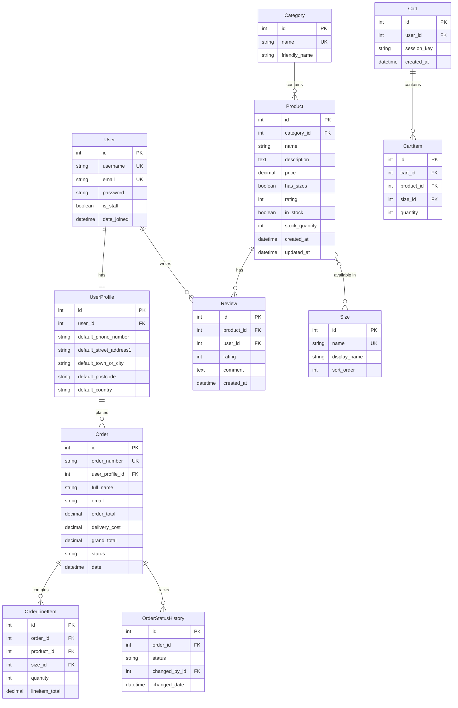

# Database Schema

## Overview

Normalized PostgreSQL database for e-commerce operations supporting user management, product catalog, shopping cart, order processing, and audit trails.

## Entity Relationship Diagram



## Design Principles

### Normalization
- 3rd Normal Form (3NF) compliance
- Foreign key constraints for referential integrity
- Unique constraints prevent duplicates
- Indexed fields for performance

### Data Integrity
- **Size Consistency**: Cannot disable `has_sizes` when sizes assigned
- **Auto Stock Status**: `in_stock` set to False when `stock_quantity` reaches 0
- **Stock Validation**: Non-negative quantities enforced
- **Rating Validation**: Integer ratings 1-5 only
- **Cascade Deletes**: CartItem → Cart
- **SET NULL**: Order → UserProfile (preserves orders)

### Timestamp Handling
- **`created_at`**: `DateTimeField(auto_now_add=True, null=True, blank=True)` - Auto-set on creation, nullable for fixtures
- **`updated_at`**: `DateTimeField(auto_now=True, null=True, blank=True)` - Auto-updated on save, nullable for fixtures

## Core Models

### User Management
- **User**: Django built-in (username, email, password, is_staff)
- **UserProfile**: Extended info, delivery defaults (auto-created via signal)

### Product Catalog
- **Category**: Product categorization (6 categories: Road Bikes, Mountain Bikes, Electric Bikes, Accessories, Components, Sale Items)
- **Size**: Reusable sizes (S, M, L, XL)
- **Product**: Main product model with pricing, stock, ratings, bicycle-specific fields
- **Review**: Customer reviews (one per user per product)

### Shopping
- **Cart**: User or session-based shopping cart
- **CartItem**: Products in cart with quantity and optional size

### Orders
- **Order**: Customer orders with UUID order_number, delivery info, payment details, status
- **OrderLineItem**: Products in order (auto-updates order total via signals)
- **OrderStatusHistory**: Audit trail for status changes

## Business Logic

### Product Size Management
**Rule**: Cannot disable `has_sizes` if sizes are assigned

**Why**: Prevents orphaned size data in orders/cart

**Implementation**:
```python
if not self.has_sizes and self.sizes.exists():
    raise ValidationError("Remove all sizes first")
```

### Stock Management
**Rule**: When `stock_quantity` = 0, `in_stock` automatically set to False

**Why**: Ensures accurate availability, prevents integrity errors

**Features**:
- Auto-decrement on order placement
- Overselling prevention
- Cart/checkout validation

### Rating Validation
- Integer values 1-5 only
- Model and form level enforcement
- No decimal ratings

## Key Relationships

| Relationship | Type | Notes |
|--------------|------|-------|
| User → UserProfile | 1:1 | Auto-created via signal |
| Product → Size | M:M | Cannot disable if assigned |
| Product → Category | M:1 | SET_NULL on category delete |
| Cart → CartItem | 1:M | Unique (cart, product, size) |
| Order → OrderLineItem | 1:M | Auto-updates order total |
| User → Review | 1:M | One review per product |

## Constraints

### Unique
- User: username, email
- Category: name
- Size: name
- Order: order_number
- Review: (product_id, user_id)
- CartItem: (cart_id, product_id, size_id)

### Validation
- Product rating: 1-5 (MinValueValidator, MaxValueValidator)
- Stock quantity: ≥ 0 (PositiveIntegerField)
- Order total: ≥ 0
- Line item quantity: ≥ 1

## Performance

### Indexes
- Auto: Primary keys, foreign keys, unique fields
- Custom: Product name (search), category+in_stock (filtering), order date (sorting)

### Query Optimization
```python
# Use select_related and prefetch_related
products = Product.objects.select_related('category').prefetch_related('sizes')
orders = Order.objects.select_related('user_profile').prefetch_related('lineitems__product')
```

## Security

- **Password Hashing**: Django PBKDF2
- **SQL Injection**: ORM parameterized queries
- **XSS Protection**: Template auto-escaping
- **CSRF Protection**: Enabled for all forms
- **Access Control**: Users access only their own orders/reviews
- **Audit Trails**: Timestamps and status history

## Testing

```python
# Model validation
def test_product_rating_validation(self):
    product = Product(rating=6)
    with self.assertRaises(ValidationError):
        product.full_clean()

# Relationships
def test_user_profile_auto_creation(self):
    user = User.objects.create_user('test')
    self.assertTrue(hasattr(user, 'userprofile'))

# Foreign key behavior
def test_order_preserves_on_profile_delete(self):
    order.user_profile.delete()
    order.refresh_from_db()
    self.assertIsNone(order.user_profile)
```

## Migrations

- **Incremental**: Small, focused changes
- **Reversible**: All migrations can be rolled back
- **Data Safe**: Tested with production data preservation
- **Key Migrations**: Initial structure, size system, stock tracking, order status, payment integration

---

**Database provides solid foundation for production e-commerce with proper normalization, performance optimization, and security.**
