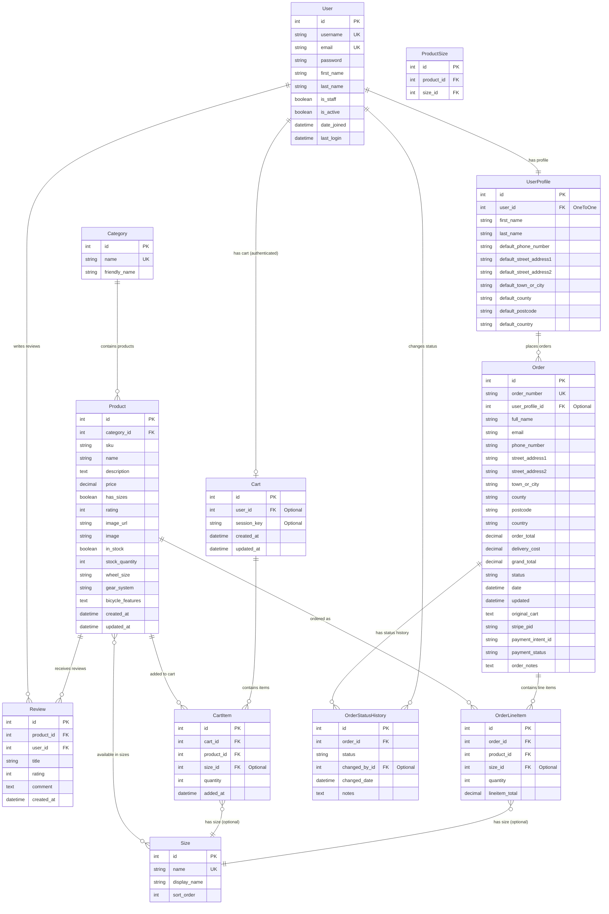

# 🗄️ Database Schema Documentation

## Overview

The Wiesbaden Cyclery platform uses a normalized PostgreSQL database design optimized for e-commerce operations. The schema supports user management, product catalog, shopping cart functionality, order processing, and comprehensive audit trails.

## 📊 Entity Relationship Diagram



## 🏗️ Database Design Principles

### **Normalization**
- **3rd Normal Form (3NF)** compliance to eliminate data redundancy
- **Foreign Key Constraints** ensure referential integrity
- **Unique Constraints** prevent duplicate data
- **Proper Indexing** on frequently queried fields

### **Data Integrity**
- **Cascade Deletes** where appropriate (CartItem → Cart)
- **SET NULL** for optional relationships (Order → UserProfile)
- **Validation Rules** at model level with Django validators
- **Audit Trails** with created/updated timestamps

### **Performance Optimization**
- **Database Indexes** on foreign keys and search fields
- **Select Related** and **Prefetch Related** for query optimization
- **Decimal Fields** for precise financial calculations
- **Efficient Queries** with Django ORM best practices

## 📋 Model Descriptions

### **User Management Models**

#### **User (Django Built-in)**
```python
# Django's built-in User model
- id: Primary key
- username: Unique username for login
- email: User's email address (unique)
- password: Hashed password
- first_name, last_name: User's name
- is_staff: Admin access flag
- is_active: Account status
- date_joined: Registration timestamp
```

#### **UserProfile**
```python
# Extended user information
- user: OneToOne relationship with User
- first_name, last_name: Profile name (can differ from User model)
- default_*: Saved delivery information for quick checkout
- Automatically created when User is created (Django signal)
```

### **Product Catalog Models**

#### **Category**
```python
# Product categorization
- name: Internal category name (e.g., 'road_bikes')
- friendly_name: Display name (e.g., 'Road Bikes')
- Used for navigation and filtering
```

#### **Size**
```python
# Product size options
- name: Internal size code (e.g., 'M', 'L')
- display_name: User-friendly size (e.g., 'Medium', 'Large')
- sort_order: Display ordering
- Many-to-many with Product through ProductSize
```

#### **Product**
```python
# Main product model
- category: Foreign key to Category
- sku: Stock keeping unit (optional)
- name: Product name
- description: Detailed product description
- has_sizes: Boolean flag for size availability
- price: Decimal field for precise pricing
- rating: Integer rating (1-5 stars)
- image_url, image: Product images (URL or uploaded file)
- in_stock, stock_quantity: Inventory management
- wheel_size, gear_system, bicycle_features: Bicycle-specific fields
- created_at, updated_at: Audit timestamps
- sizes: Many-to-many relationship with Size
```

#### **Review**
```python
# Customer product reviews
- product: Foreign key to Product
- user: Foreign key to User
- title: Review headline
- rating: Star rating (1-5)
- comment: Review text
- created_at: Review timestamp
- Unique constraint: One review per user per product
```

### **Shopping Cart Models**

#### **Cart**
```python
# Shopping cart for users and sessions
- user: Optional foreign key for authenticated users
- session_key: Optional session key for anonymous users
- created_at, updated_at: Cart timestamps
- Supports both authenticated and anonymous shopping
```

#### **CartItem**
```python
# Individual items in shopping cart
- cart: Foreign key to Cart
- product: Foreign key to Product
- size: Optional foreign key to Size
- quantity: Number of items
- added_at: When item was added
- Unique constraint: (cart, product, size)
```

### **Order Processing Models**

#### **Order**
```python
# Customer orders
- order_number: Unique UUID-based order identifier
- user_profile: Optional link to UserProfile
- Customer information: name, email, phone
- Delivery address: Complete address fields with country
- Financial totals: order_total, delivery_cost, grand_total
- status: Order status (pending, processing, shipped, delivered, cancelled)
- Payment information: Stripe payment intent details
- Audit fields: date, updated, order_notes
```

#### **OrderLineItem**
```python
# Individual products in an order
- order: Foreign key to Order
- product: Foreign key to Product
- size: Optional foreign key to Size
- quantity: Number of items ordered
- lineitem_total: Calculated total (price × quantity)
- Automatically updates order total via Django signals
```

#### **OrderStatusHistory**
```python
# Audit trail for order status changes
- order: Foreign key to Order
- status: New status value
- changed_by: Optional foreign key to User (admin who made change)
- changed_date: When status was changed
- notes: Optional notes about the change
```

## 🔍 Key Relationships

### **User → UserProfile (1:1)**
- Every User automatically gets a UserProfile
- Created via Django post_save signal
- Stores extended user information and delivery defaults

### **Product → Size (M:M)**
- Products can have multiple sizes (S, M, L, XL)
- Sizes are reusable across products
- `has_sizes` boolean controls size requirement

### **Cart → CartItem (1:M)**
- Each cart can contain multiple items
- Supports both user-based and session-based carts
- Unique constraint prevents duplicate items

### **Order → OrderLineItem (1:M)**
- Orders contain multiple line items
- Line items automatically update order totals
- Preserves product information at time of order

### **Product Reviews (M:M through Review)**
- Users can review products they've purchased
- One review per user per product
- Ratings contribute to product rating calculation

## 💾 Database Constraints

### **Unique Constraints**
```sql
-- Prevent duplicate data
User.username UNIQUE
User.email UNIQUE
Category.name UNIQUE
Size.name UNIQUE
Order.order_number UNIQUE
(Review.product_id, Review.user_id) UNIQUE
(CartItem.cart_id, CartItem.product_id, CartItem.size_id) UNIQUE
```

### **Foreign Key Constraints**
```sql
-- Maintain referential integrity
UserProfile.user_id → User.id (CASCADE)
Product.category_id → Category.id (SET_NULL)
Review.product_id → Product.id (CASCADE)
Review.user_id → User.id (CASCADE)
Order.user_profile_id → UserProfile.id (SET_NULL)
OrderLineItem.order_id → Order.id (CASCADE)
```

### **Check Constraints**
```python
# Model-level validation
Product.rating: MinValueValidator(1), MaxValueValidator(5)
Product.stock_quantity: PositiveIntegerField
Order.order_total: MinValueValidator(0)
OrderLineItem.quantity: MinValueValidator(1)
```

## 📈 Performance Considerations

### **Database Indexes**
```python
# Automatic indexes on:
- Primary keys (id fields)
- Foreign keys (all *_id fields)
- Unique fields (username, email, order_number)

# Custom indexes for:
- Product.name (search functionality)
- Product.category_id + Product.in_stock (filtering)
- Order.date (order history sorting)
- Review.created_at (review display ordering)
```

### **Query Optimization**
```python
# Efficient QuerySets
products = Product.objects.select_related('category').prefetch_related('sizes', 'reviews')
orders = Order.objects.select_related('user_profile__user').prefetch_related('lineitems__product')
cart_items = CartItem.objects.select_related('product', 'size')
```

### **Caching Strategy**
```python
# Template fragment caching

# View-level caching for product listings
# Database query result caching for expensive operations
```

## 🔒 Security Considerations

### **Data Protection**
- **Password Hashing**: Django's built-in PBKDF2 algorithm
- **SQL Injection Prevention**: Django ORM parameterized queries
- **XSS Protection**: Template auto-escaping enabled
- **CSRF Protection**: Enabled for all forms

### **Access Control**
- **User Authentication**: Django's session-based authentication
- **Admin Access**: `is_staff` flag controls admin interface access
- **Order Access**: Users can only view their own orders
- **Review Permissions**: Users can only edit their own reviews

### **Audit Trails**
- **Order History**: Complete status change tracking
- **Timestamps**: All models have created/updated timestamps
- **User Actions**: Admin actions logged with user attribution
- **Payment Tracking**: Stripe payment intent IDs preserved

## 🧪 Testing Database Operations

### **Model Tests**
```python
# Test model validation
def test_product_rating_validation(self):
    product = Product(rating=6)  # Invalid rating
    with self.assertRaises(ValidationError):
        product.full_clean()

# Test relationships
def test_user_profile_creation(self):
    user = User.objects.create_user('testuser')
    self.assertTrue(hasattr(user, 'userprofile'))
```

### **Database Integrity Tests**
```python
# Test foreign key constraints
def test_order_user_profile_deletion(self):
    # Order should remain when UserProfile is deleted
    order.user_profile.delete()
    order.refresh_from_db()
    self.assertIsNone(order.user_profile)
```

## 📊 Database Migrations

### **Migration Strategy**
- **Incremental Migrations**: Small, focused changes
- **Data Migrations**: Separate data transformation migrations
- **Rollback Safety**: All migrations designed to be reversible
- **Production Safety**: Tested migrations with data preservation

### **Key Migrations**
1. **Initial Migration**: Basic model structure
2. **Size System**: Added many-to-many size relationships
3. **Stock Tracking**: Added inventory management fields
4. **Order Status**: Added status history tracking
5. **Payment Integration**: Added Stripe payment fields

This database schema provides a solid foundation for a production e-commerce platform with proper normalization, performance optimization, and security considerations.