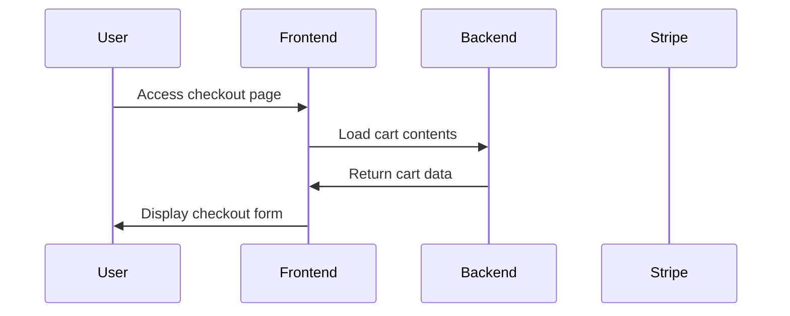
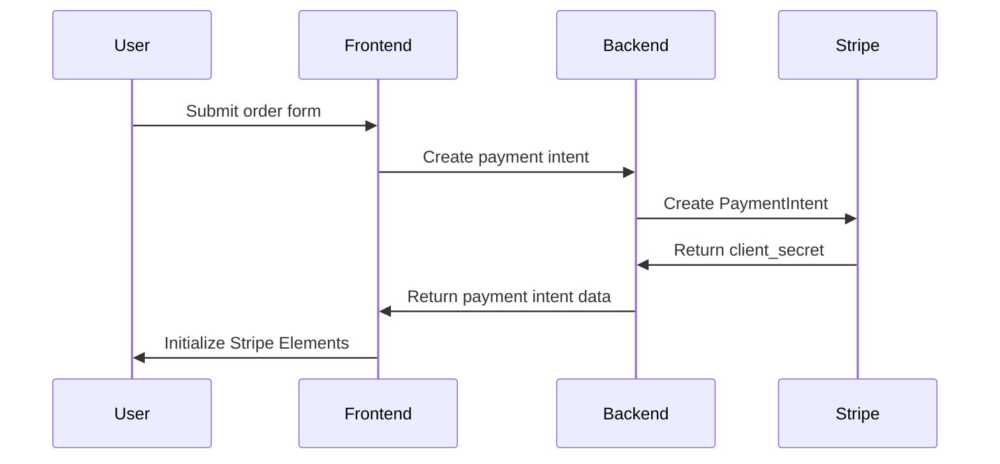
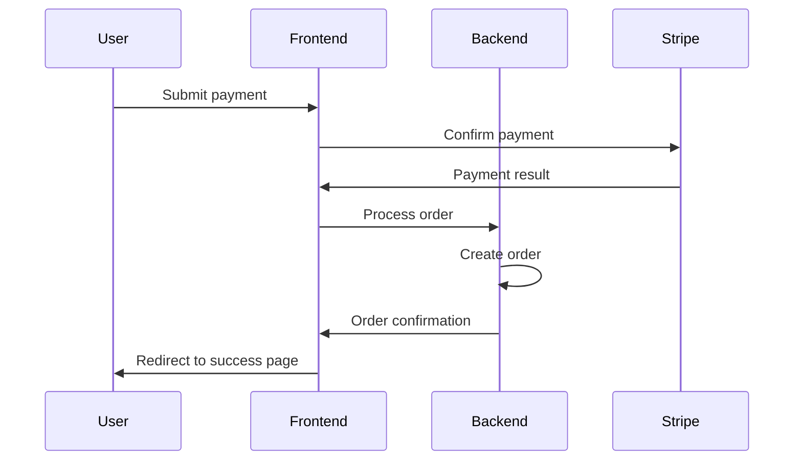
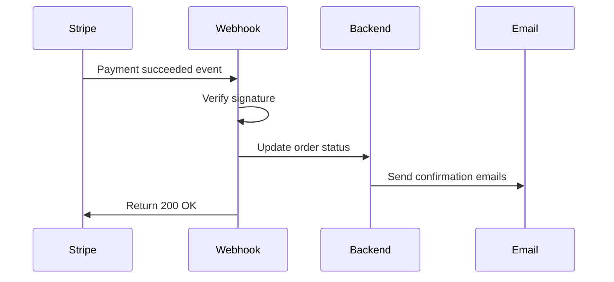

# Wiesbaden Cyclery Payment System Documentation

## Overview

The Wiesbaden Cyclery payment system provides a comprehensive, secure, and user-friendly payment processing solution built on Stripe. This documentation covers the complete payment system architecture, implementation, and usage.

## Table of Contents

1. [Architecture Overview](#architecture-overview)
2. [Payment Flow](#payment-flow)
3. [Security Features](#security-features)
4. [Error Handling](#error-handling)
5. [Webhook System](#webhook-system)
6. [Testing](#testing)
7. [Configuration](#configuration)
8. [Troubleshooting](#troubleshooting)
9. [API Reference](#api-reference)

## Architecture Overview

### Core Components

```
┌─────────────────┐    ┌─────────────────┐    ┌─────────────────┐
│   Frontend      │    │   Django        │    │   Stripe        │
│   (Checkout)    │◄──►│   Backend       │◄──►│   API           │
└─────────────────┘    └─────────────────┘    └─────────────────┘
         │                       │                       │
         │                       │                       │
         ▼                       ▼                       ▼
┌─────────────────┐    ┌─────────────────┐    ┌─────────────────┐
│   Stripe        │    │   Database      │    │   Webhook       │
│   Elements      │    │   (Orders)      │    │   Handler       │
└─────────────────┘    └─────────────────┘    └─────────────────┘
```

### Key Models

- **Order**: Main order entity with customer and payment information
- **OrderLineItem**: Individual items within an order
- **OrderStatusHistory**: Audit trail of order status changes

### Payment Processing Components

- **Stripe Integration** (`stripe_utils.py`): Core Stripe API interactions
- **Payment Error Handling** (`payment_errors.py`): Comprehensive error management
- **Webhook Processing** (`webhooks.py`): Stripe webhook event handling
- **Order Management** (`views.py`): Order creation and management views

## Payment Flow

### 1. Checkout Initiation



### 2. Payment Intent Creation



### 3. Payment Processing



### 4. Webhook Processing



## Security Features

### 1. Payment Security

- **PCI Compliance**: Stripe Elements ensures PCI DSS compliance
- **Tokenization**: Card data never touches our servers
- **3D Secure**: Automatic 3D Secure authentication when required
- **Fraud Detection**: Stripe's built-in fraud detection

### 2. Application Security

- **CSRF Protection**: All payment endpoints protected with CSRF tokens
- **Authentication**: User authentication for order access
- **Authorization**: Users can only access their own orders
- **Input Validation**: Comprehensive server-side validation

### 3. Webhook Security

- **Signature Verification**: All webhooks verified with Stripe signatures
- **Idempotency**: Duplicate webhook events are prevented
- **Rate Limiting**: Protection against webhook flooding
- **IP Validation**: Optional IP whitelist validation

## Error Handling

### Error Categories

1. **Card Errors**: Declined cards, expired cards, insufficient funds
2. **Network Errors**: Connection timeouts, network failures
3. **API Errors**: Authentication failures, rate limits
4. **Validation Errors**: Invalid amounts, missing parameters

### Error Response Format

```json
{
  "success": false,
  "error_code": "card_declined",
  "error_type": "card_error",
  "user_message": "Your card was declined. Please try a different payment method.",
  "recovery_action": "try_different_card",
  "severity": "high",
  "retry_allowed": false
}
```

### Recovery Actions

- **try_different_card**: User should use a different payment method
- **retry_payment**: User can retry the same payment
- **contact_bank**: User should contact their bank
- **contact_support**: User should contact customer support
- **wait_retry**: User should wait before retrying

## Webhook System

### Supported Events

- `payment_intent.succeeded`: Payment completed successfully
- `payment_intent.payment_failed`: Payment failed
- `payment_intent.canceled`: Payment was canceled
- `payment_intent.requires_action`: Additional authentication required
- `payment_intent.processing`: Payment is being processed
- `charge.dispute.created`: Chargeback/dispute created

### Webhook Configuration

1. **Stripe Dashboard Setup**:
   - Go to https://dashboard.stripe.com/webhooks
   - Add endpoint: `https://yourdomain.com/orders/webhook/stripe/`
   - Select events listed above
   - Copy webhook signing secret

2. **Environment Configuration**:
   ```bash
   STRIPE_WH_SECRET=whsec_your_webhook_secret_here
   ```

### Webhook Processing Features

- **Signature Verification**: Ensures webhooks are from Stripe
- **Idempotency**: Prevents duplicate processing
- **Error Recovery**: Failed webhooks can be retried
- **Monitoring**: Comprehensive webhook analytics
- **Alerting**: Critical error notifications

## Testing

### Test Categories

1. **Unit Tests**: Individual component testing
2. **Integration Tests**: End-to-end payment flow testing
3. **Security Tests**: Authentication and authorization testing
4. **Error Handling Tests**: Error scenario validation

### Running Tests

```bash
# Run all payment tests
python manage.py test orders

# Run specific test categories
python manage.py test orders.tests.StripeIntegrationTests
python manage.py test orders.tests.PaymentErrorHandlingTests
python manage.py test orders.tests.WebhookTests

# Run with coverage
coverage run --source='.' manage.py test orders
coverage report
```

### Test Data

Use Stripe test cards for testing:

- **Successful Payment**: `4242 4242 4242 4242`
- **Declined Card**: `4000 0000 0000 0002`
- **Insufficient Funds**: `4000 0000 0000 9995`
- **Expired Card**: `4000 0000 0000 0069`

### Manual Testing Checklist

- [ ] Successful payment flow
- [ ] Card declined handling
- [ ] Network error recovery
- [ ] Webhook processing
- [ ] Order confirmation emails
- [ ] User order history
- [ ] Admin order management

## Configuration

### Environment Variables

```bash
# Stripe Configuration
STRIPE_PUBLIC_KEY=pk_test_your_public_key
STRIPE_SECRET_KEY=sk_test_your_secret_key
STRIPE_WH_SECRET=whsec_your_webhook_secret

# Email Configuration
EMAIL_HOST_USER=your_email@gmail.com
EMAIL_HOST_PASSWORD=your_app_password
DEFAULT_FROM_EMAIL=your_email@gmail.com
ADMIN_EMAIL=admin@yourdomain.com

# Support Configuration
SUPPORT_EMAIL=support@yourdomain.com
SUPPORT_PHONE=+49123456789
```

### Django Settings

```python
# Stripe Configuration
STRIPE_CURRENCY = 'eur'
STRIPE_PUBLIC_KEY = config('STRIPE_PUBLIC_KEY', default='')
STRIPE_SECRET_KEY = config('STRIPE_SECRET_KEY', default='')
STRIPE_WH_SECRET = config('STRIPE_WH_SECRET', default='')

# Email Configuration
EMAIL_BACKEND = 'django.core.mail.backends.smtp.EmailBackend'
EMAIL_USE_TLS = True
EMAIL_PORT = 587
EMAIL_HOST = 'smtp.gmail.com'
EMAIL_HOST_USER = config('EMAIL_HOST_USER', default='')
EMAIL_HOST_PASSWORD = config('EMAIL_HOST_PASSWORD', default='')
```

## Troubleshooting

### Common Issues

#### 1. Payment Intent Creation Fails

**Symptoms**: Error creating payment intent
**Causes**: Invalid API keys, network issues, invalid amount
**Solutions**:
- Verify Stripe API keys
- Check network connectivity
- Validate payment amount (minimum €0.50)

#### 2. Webhooks Not Processing

**Symptoms**: Orders not updating after payment
**Causes**: Invalid webhook secret, endpoint not accessible
**Solutions**:
- Verify webhook secret matches Stripe dashboard
- Ensure webhook endpoint is publicly accessible
- Check webhook logs in Stripe dashboard

#### 3. Card Declined Errors

**Symptoms**: All cards being declined
**Causes**: Test/live mode mismatch, insufficient funds
**Solutions**:
- Verify using correct Stripe keys for environment
- Use appropriate test cards
- Check card details and limits

#### 4. Email Notifications Not Sending

**Symptoms**: No confirmation emails sent
**Causes**: SMTP configuration, email credentials
**Solutions**:
- Verify SMTP settings
- Check email credentials
- Test email configuration

### Debugging Tools

#### 1. Management Commands

```bash
# Validate Stripe configuration
python manage.py validate_stripe

# Test webhook configuration
python manage.py test_webhooks --validate-config

# Check payment error handling
python test_payment_errors.py
```

#### 2. Logging

Enable detailed logging in `settings.py`:

```python
LOGGING = {
    'version': 1,
    'disable_existing_loggers': False,
    'handlers': {
        'file': {
            'level': 'INFO',
            'class': 'logging.FileHandler',
            'filename': 'payment.log',
        },
    },
    'loggers': {
        'orders': {
            'handlers': ['file'],
            'level': 'INFO',
            'propagate': True,
        },
    },
}
```

#### 3. Stripe CLI

Use Stripe CLI for local webhook testing:

```bash
# Install Stripe CLI
# https://stripe.com/docs/stripe-cli

# Login to Stripe
stripe login

# Forward webhooks to local server
stripe listen --forward-to localhost:8000/orders/wh/

# Trigger test events
stripe trigger payment_intent.succeeded
```

## API Reference

### Payment Intent Creation

**Endpoint**: `POST /orders/ajax/create-payment-intent/`

**Request**:
```json
{
  "full_name": "John Doe",
  "email": "john@example.com",
  "phone_number": "+49123456789"
}
```

**Response**:
```json
{
  "success": true,
  "client_secret": "pi_xxx_secret_xxx",
  "payment_intent_id": "pi_xxx",
  "amount": 30499,
  "currency": "eur"
}
```

### Payment Processing

**Endpoint**: `POST /orders/ajax/process-payment/`

**Request**:
```json
{
  "payment_intent_id": "pi_xxx",
  "order_form": {
    "full_name": "John Doe",
    "email": "john@example.com",
    "street_address1": "Main St 123",
    "town_or_city": "Berlin",
    "country": "DE"
  }
}
```

**Response**:
```json
{
  "success": true,
  "order_number": "ABC123DEF456",
  "redirect_url": "/orders/confirmation/ABC123DEF456/"
}
```

### Error Recovery

**Endpoint**: `POST /orders/ajax/payment-error-recovery/`

**Request**:
```json
{
  "error_code": "card_declined",
  "payment_intent_id": "pi_xxx"
}
```

**Response**:
```json
{
  "success": true,
  "recovery_info": {
    "message": "Your card was declined. Please try a different payment method.",
    "action": "try_different_card",
    "instructions": [
      "Try using a different credit or debit card",
      "Ensure your card is activated and not expired",
      "Contact your bank if you continue to have issues"
    ],
    "severity": "high"
  }
}
```

## Production Deployment

### Pre-deployment Checklist

- [ ] Stripe live keys configured
- [ ] Webhook endpoint configured in Stripe dashboard
- [ ] HTTPS enabled for all payment pages
- [ ] Email configuration tested
- [ ] Database backups configured
- [ ] Monitoring and alerting set up
- [ ] Error tracking configured (e.g., Sentry)

### Monitoring

Monitor these key metrics:

- **Payment Success Rate**: Percentage of successful payments
- **Error Rates**: Frequency of different error types
- **Webhook Processing**: Webhook success/failure rates
- **Response Times**: Payment processing performance
- **User Experience**: Checkout abandonment rates

### Maintenance

Regular maintenance tasks:

- Review payment error logs
- Monitor webhook health
- Update Stripe API version
- Review and update error messages
- Test payment flows
- Update documentation

## Support and Resources

### Internal Resources

- **Code Repository**: Payment system source code
- **Test Suite**: Comprehensive automated tests
- **Management Commands**: Diagnostic and testing tools
- **Documentation**: This comprehensive guide

### External Resources

- **Stripe Documentation**: https://stripe.com/docs
- **Stripe Dashboard**: https://dashboard.stripe.com
- **Stripe CLI**: https://stripe.com/docs/stripe-cli
- **Django Documentation**: https://docs.djangoproject.com

### Getting Help

1. **Check Logs**: Review application and payment logs
2. **Run Diagnostics**: Use management commands for testing
3. **Stripe Dashboard**: Check Stripe dashboard for payment details
4. **Documentation**: Refer to this guide and Stripe docs
5. **Support**: Contact development team or Stripe support

---

*This documentation is maintained by the Wiesbaden Cyclery development team. Last updated: December 2024*